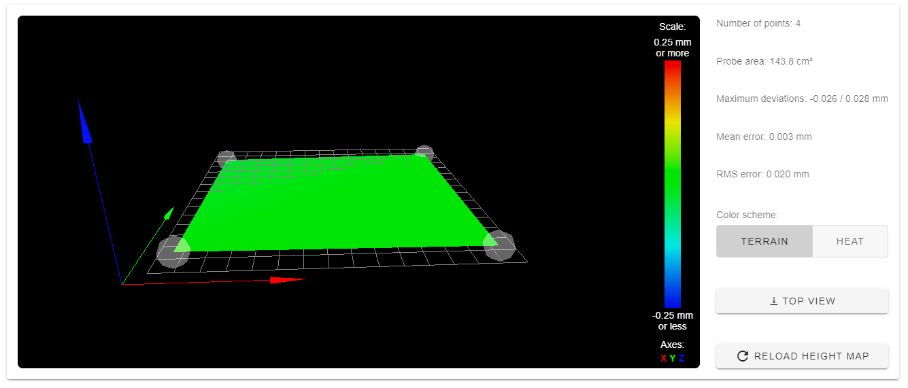

---
title: Level and Map the print bed
---   

The RailCore has two means of achieving a first layer that is edge-to-edge flat, smooth as glass, and repeatable: **Bed Leveling**, and the **Mesh** surface correction.

## Bed Leveling (Tramming)

The print bed height on a Railcore II 300ZL/300ZLT is controlled by three independent Z motors, which gives precise control over the angle between the bed and the X/Y gantry.
By sampling the height of the bed at multiple points to detect its plane, and making adjustments to each of the three motors, the bed can be brought into physical alignment with the print head gantry.  This is sometimes referred to as "Tramming the bed".

Performing the Bed Leveling cycle results in a *physical* adjustment of the bed's *tilt*, but no change to any settings or software values.  This should be done before each print, after changing build plates, or any time the Z stepper motors have been powered off.

### Procedure for Bed Leveling

#### `G32` / `bed.g`

The RRF [`G32`](https://duet3d.dozuki.com/Wiki/Gcode#Section_G32_Run_bed_g_macro) GCODE simply runs the `bed.g` macro.

The contents of `bed.g` determine the entire levelling process.  A typical default might look like this:
```
M561                          ; clear any existing Mesh bed transform

; Perform a 4 Point measurement and level
G1 Z5 S2                      ; Lower the bed 5mm for safety
G30 P0 X15 Y45 Z-99999
G30 P1 X15 Y275 Z-99999
G30 P2 X275 Y275 Z-99999
G30 P3 X275 Y45 Z-99999 S3
```

Some might prefer a 3-point probe or other specific points, but the process is the same.  Each `G30` probes a specific point and remembers it as `Pxx`.
The last `G30` command probes and calculates the offsets for the three Z motors (`S3`), adjusting them to their (predicted) optimum alignment.  The firmware will report the probe measurements, deviation, and predicted result after conclusion:

```6/10/2020, 8:35:01 PM	Leadscrew adjustments made: 0.067 0.078 0.007, points used 4, deviation before 0.051 after 0.003```

After this, the leadscrews have been adjusted.

It is important to re-home the Z axis after G32, as the height may have changed.

If deviation was improved by the bed levelling, it is a good idea to perform it again to refine the adjustment.  Ideally, it converges on a value that does not change with repeat execution, usually after two or three runs.  If the values do not converge to your liking, it's possible that the X Rails are not correctly aligned, or the coordinates of the three Z "Yoke-to-bed" mounts is not correct.  This can result in bed levelling that improves with each G32, but needs multiple cycles to converge.

A RailCore can typically achieve 0.1mm deviation for four points, and often much better if the bed is very precisely flat and linear rails in good alignment.

#### Probe point considerations

Choosing the three or four points to use in `bed.g` should be done with calculation and care.  They should be far enough apart that the planar calculation has good distance to work with, but avoid any problematic areas of the bed where irregularities could confound the results.   For Magnetic Beds under BL-Touch (magnetic) sensors, this is a unique challenge.  See some tips below for [BL-Touch considerations](#bl-touch-considerations).

Note that the probe points in `G30` are with reference to the *Probe* and not the nozzle!  The RRF firmware will factor out the known probe offsets (from your `G31`) for these movements, so the position does not match what you would see with `G1` movements.  Further, G30 will *ignore* your Endstop switches!  This is dangerous when attempting to probe portions of the bed that are physically unreachable, as it will continue to force movement into the hard limits and beyond.   For example, most builds should avoid trying `Y0` with `G30`, as it is unreachable.

#### Leadscrew definitions

The specific location of the leadscrews is important for arriving quickly at the best bed level adjustment.  The X and Y coordinates of each Z motor defines the point outside the bed where the bed pivots on the yoke.  For most RailCores, this is the location of the bed-to-yoke vertical bolt that goes through both.   A [2018 video by Tony Akens](https://www.youtube.com/watch?v=qeFGLb8Gf6U) shows one way to measure the correct offsets for your machine.

The specific values for your printer should be defined in your `config.g` with `M671` similar to this:

```
; Leadscrew locations.  Must come after M667/M669
; 5/FrontLeft : 6/RearLeft : 7/Right
; Measured to the bed-yoke bolt for each leadscrew
; (7.5mm maximum correction)
M671 X-6.5:-6.5:348  Y21.7:275.6:150 S7.5  
```

## Mesh Map 

Even with the bed parallel to the print movement, the build surface itself may not be flat; it could be warped like a wave or bowl or have dents and thermal deformation.  Mapping the high and low points of the print bed shows any irregularities or distortions in the flatness of the bed.  Software can use a matrix of these measured points as a topographic map, to raise/lower the head while printing to travel along the known shape of the surface.

For a very flat bed and build plate, the Mesh map is not necessary for real-time correction during the print, but generating a simple Mesh Map can still be a useful diagnostic to view the alignment of the X rails and bed.

### Defining probe points with `M557`

The [`M557` GCODE](https://duet3d.dozuki.com/Wiki/Gcode#Section_M557_Set_Z_probe_point_or_define_probing_grid) defines the set of points that will be probed to build the Mesh map.  You may choose to probe only four representative points, or make a detailed map with hundreds of points.

The best probe grid depends on the bed design, build surface, and depth probe.  A bed with embedded magnets might put specific constraints on where a BL-Touch can be used, for example.  Further, the X/Y offset between the Nozzle and Probe will exclude some portion of the bed from being probed at all.

The number of probe points is specified by either the `P` parameter for points in X & Y, or the `S` parameter for space between points.

Popular map grids seen in use on Railcore include:
* `M557 X45:282 Y46:254 P2:2` from @JohnOCFII to avoid magnets in a 713 Magnetic bed with rectangular magnets
* `M557 X10:295 Y10:295 S57:57` from @elmoret to avoid magnets in a Mandala Rose Works 9-magnet bed
* `M557 X115:240 Y94:209 S125:115` 4-point rectangle I measured to keep maximum distance from MRW bed magnets
* [Mandala Rose Works 9-magnet bed Probe point calculator](https://docs.google.com/spreadsheets/d/19sg3DF3PqzK8-KJ13Eh1PQMJRK1Q9LHXkGnUAmX1ld8/edit?usp=sharing) by @Max_plastix

### Mapping with `G29`

Ideally, the bed should be mapped at your intended printing temperature, since some materials and beds may change with thermal expansion.

The [G29 GCODE](https://duet3d.dozuki.com/Wiki/Gcode#Section_G29_Mesh_bed_probe) probes each point of the defined mesh, saves the results to `/sys/heightmap.csv`, and activates bed compensation.   Prints with bed compensation enabled will adjust the Z Height in real-time to travel along the mapped print surface.

The bed map can be seen visually in the Duet Web interface under Height Map.  Even a 4-point map is useful to show the deviations and RMS error in the measured points, guiding rail adjustments for alignment.



Note that RRF2 shows the map *inverted* from a typical model of the print surface!  The points show a distance from the nozzle, not physical bed height, so a high point on the mesh map is *further* from the nozzle.

To flush or disable the bed compensation, `G29 S2` can be used to clear the height map.  For very flat build surfaces, this is generally preferred to avoid Z micro-adjustments in the first layers.

## Interaction between Bed Level and Mesh Map

While Bed Level (physical tramming) and the Mesh Map are unrelated, any adjustment to one may invalidate the other.  It's important to invalidate the Mesh Map as part of Bed Levelling (`bed.g`), and recalculate a fresh Mesh Map after any Bed Levelling.

## BL-Touch considerations

The BL-Touch probe uses a magnet on a pin to detect surface contact, by lifting the magnet to a hall-effect sensor.  This means that any external magnetic field can cause a higher or lower trigger point, and a distorted depth reading.

For accurate BL-Touch mesh maps, magnetic beds pose a unique challenge, as proximity to any magnet will appear as a very high or low irregularity in the bed.  By carefully choosing mesh points, this can be partly mitigated.  The [Magnet Probe Point spreadsheet](https://docs.google.com/spreadsheets/d/19sg3DF3PqzK8-KJ13Eh1PQMJRK1Q9LHXkGnUAmX1ld8/edit) can help calculate the magnet positions for some recommend points away from known magnets, suitable for `G30`, `M557` and Z Home operations.

## First-layer Height

Once the bed is physically level, and any irregularity is mapped and compensated, the height of the nozzle at the first layer should be predictable and repeatable.  The probe offset, Babystep adjustment, and Z Home accuracy should result in perfect first-layer results.
