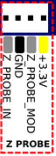
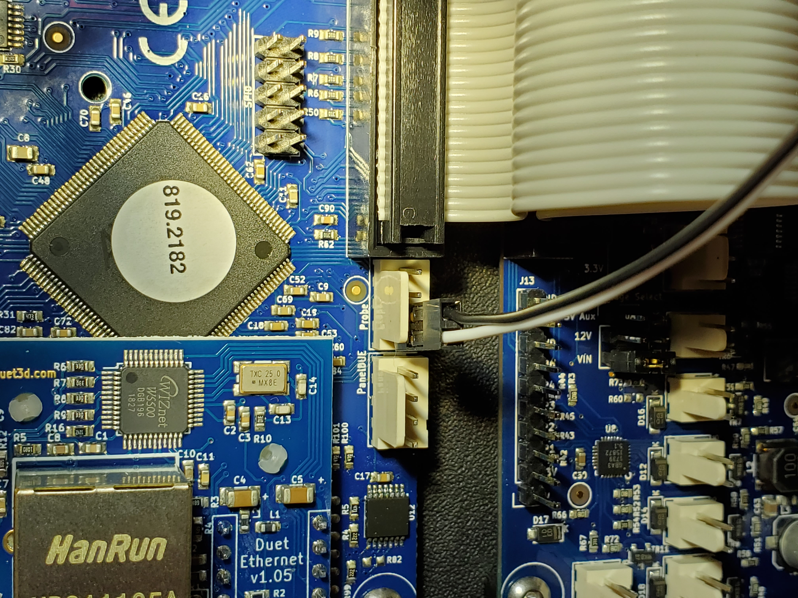
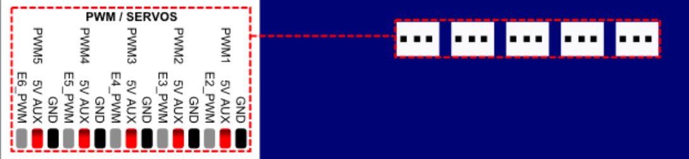
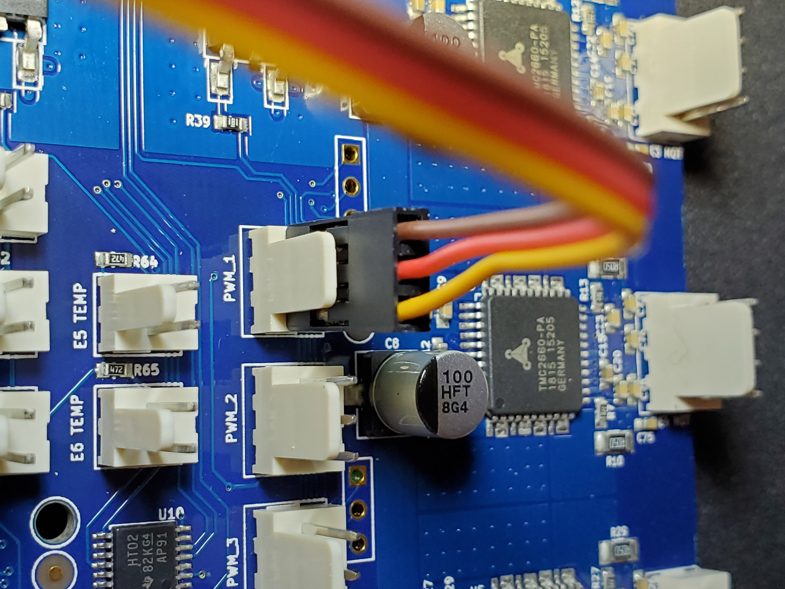

# BL-Touch
## Function
The BL-Touch sensor has three basic parts:
* A plastic pin with a magnet on top
* A circuit board with hall-effect sensor and controller
* A housing with a solenoid-like coil at the top

## Connectors
It emulates a microswitch and servo in function, so the wiring harness has five wires on two separate connectors:
1. The 2-pin Black & White wire connector is the probe endstop signal from BL-Touch, like a microswitch
1. The 3-pin connector is the control and power:

| Wire | Function |
| --- | ---|
| Brown | Ground |
| Orange | +5v |
| Yellow | Pulse-width servo control |

## Duet2 Connections
When facing the RailCore electronics panel and mounted Duet2, use the two pins on the **left side** of the "Z PROBE" 4-pin header.  The White lead goes on the far-left contact ("Z_PROBE_IN"), and black to GND.
Leave the two remaining pins on the right side unoccupied (Z_PROBE_MOD & +3.3V)




The Three-pin connector from BL-Touch is the control and power to the probe.  Connect this to the 3-pin connector on Duet for PWM1.
The Brown wire (ground) should be on the right pin, facing the connector.




For these connectors, a configuration line like this in `config.g` might be appropriate:
```
; Z probe and compensation definition for BL-Touch
M558 P9 X0 Y0 Z1 F50 T6000 A5 S0.02 H5
G31 X3.0 Y40.8 Z2.104 P25
```
Note that this will need adjusting for your printer, as your BL-Touch offsets may not be the same.
The `G31` command **must come after** the `M558` definition in your `config.g`!

Here are the parameter arguments explained:
```
; P9: BL-Touch deploy/retract method
; F50: Probe Z speed in mm/min
; T6000: Travel speed between points
; A5 Maximum probes between each point to achieve uniform values
; S0.02 Tolerance when probing multiple times
; X0 Y0 Z1 Use this probe for Z axis endstop
; H3 5mm dive height (depends on how fast your BL Touch deploys)
```
