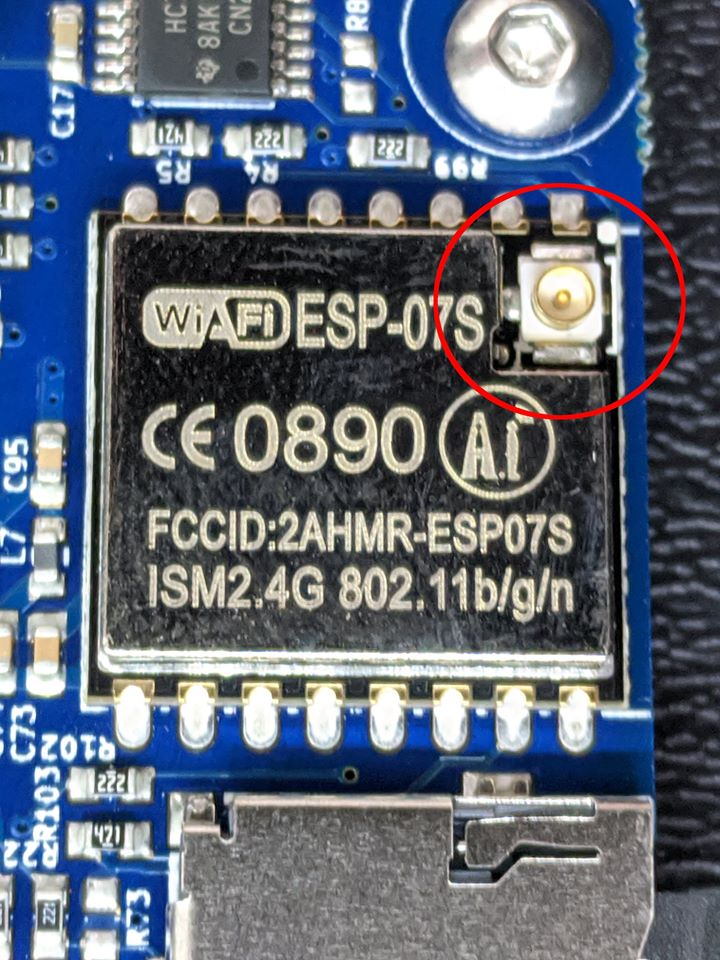
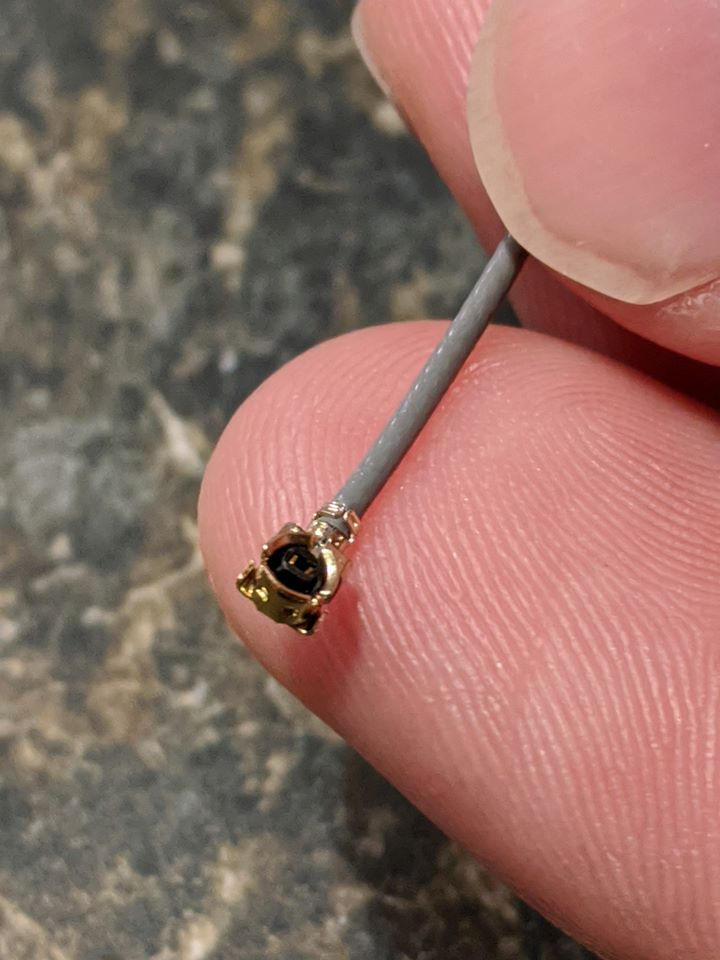
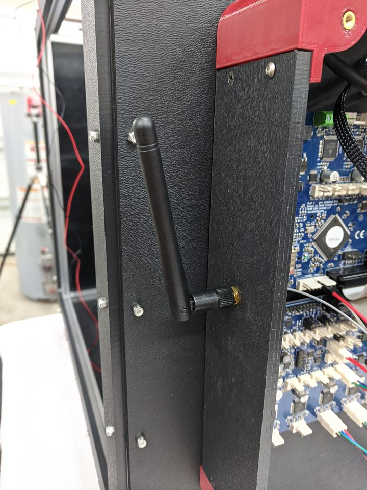
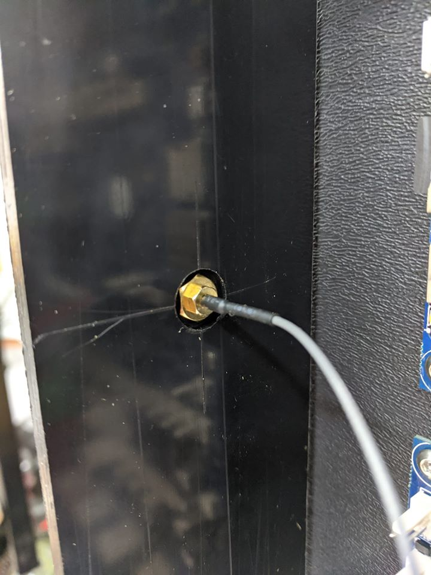

 Find ipex connector.
 
 
 This is the connector on the antenna wire.
  
 
  the antenna mounted
  
  
   The backside is counterbored, so there is enough thread protruding from the front to properly attach the antenna.
   
