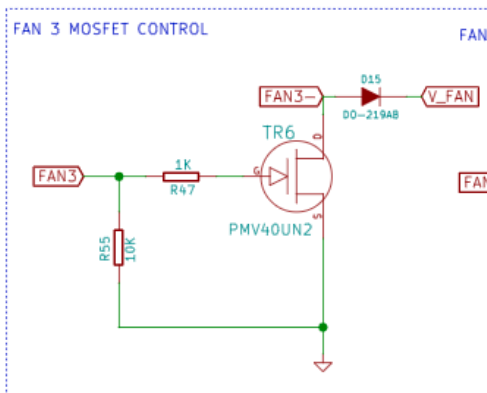

In the standard build, the RailCore's Duet2 board supports only 24v Fans but the Duex5 makes it very easy to add 12v Fans to your design.

Inexpensive 12v fans in 120mm, 80mm or other common computer-case size can be used to cool the electronics enclosure or printer interior, and the Duet firmware makes it easy to assign a thermostat for fan control.  The Duex5 provides a built-in 12v 2A switching regulator for LEDs or Fans, but it is not enabled by default.

# Enable the 12v Power Supply
Study the [Duex5 Connection Pinout](https://duet3d.dozuki.com/Wiki/Duex_wiring_diagrams) to identify the `INT 12V EN` jumper near the top-left of the board.
You must connect a jumper across these two pins to turn on the 12v power supply, as it is not enabled by default.

# Change the V_FAN power to 12v
By default, the Duex uses 24v for all `V_FAN` connections.  Locate `V_FAN JUMPER SELECT` and move the jumper from `VIN` (far left) to `12V` in the middle.  This changes all V_FAN PWM ports to use 12v.

# Connect 12v Fans (2-wire or 3-wire)
The 2-pin ports `FAN3` to `FAN8` can be used for 12v fans.

Note that these ports share a common +12v V_FAN supply which is powered at all times.  The negative or ground of the fan is modulated to adjust power for PWM.  Multiple fans can share positive power, but not a common ground!


# Enable Fans 
## Direct speed control
Each fan can be added as a controllable PWM fan with DWC (Web) control over speed:

```M106 P3 H-1 B0.2 I0 C"HappyFan" 	; FAN3```

Here the `P3` indicates the port, and other options configure the initial burst and name.

## Thermostat control
To use thermostatic control instead of direct PWM setting, you must first configure a Virtual Heater with a thermometer of interest.  For example, an extra NTC 100K added to E4 might be configured as Virtual Heater #106 this way:

```M305 P106 X5 T100000 B3950 R4700 C0 H0 L0 S"Chamber"```

Then the fan can use this Virtual Heater to adjust fan speed for a target temperature:

```M106 P3 H106 T60:62 L0.01 S1.00 B0.1 I0 C"Chamber Fan"```

Here the `H106` refers to the Virtual Heater assigned, and `P3`is the `FAN3` port on Duex.  The fan will turn on 1% speed at 60°C and ramp to maximum 100% speed by 62°C, which holds the temperature pretty even and close to 60.

For individual filaments, you could even adjust just the target temperature set-point with gcode, for example: `M106 P3 T45:47`.

Note that a fan configured for Thermostatic control will not appear in the web interface.  You can check its operation with `M106 P3` in this example.

# RPM Speed input

The Duex brings out pin `PB6` on the GPIO header for Fan RPM monitoring.  Unfortunately, this does not appear to be compatible with PWM speed control, and may be mismatched to the pules-per-RPM used by some computer fans.  Connecting `PB6` requires an inline diode for 3-wire fans, as described in the [Duet Fan documentation](https://duet3d.dozuki.com/Wiki/Connecting_and_configuring_fans).

On RRF2, it's useful only as a displayed value, and probably not worth the effort to connect.

# 4-Wire Fans
In a 2-wire or 3-wire fan, the Duet is pulsing power to the fan, effectively the same as adjusting voltage downward to run slower.  Small pulses of power cause the fan to turn slowly, while full-time power turns at maximum speed.  The Duex pulses power 250 times a second on its PWM Ports.  If there is a third wire, it is to report the speed back to the controller for RPM display, but it doesn't control anything.

"Four-wire" fans borrowed from the Personal Computer space can operate differently than 2-Wire (Power-only) or 3-Wire (Power & RPM reporting).  Unfortunately, the specific wire colors are not standardized, but usually:

1. Ground (Black or Gray)
2. +12V Power (Red or Yellow) 
3. Sense, Tachometer (Yellow or Green)
4. Control PWM (Blue)

The fourth "Control PWM" wire allows the 12 Power to be constant (always on), while this new PWM signal to the fan tells it how fast to run.  This can result in a fan with more-certain low-speed operation, precise and predictable speed control, and less audible humming since the power is not being interrupted.  Since 4-wire fans usually default to "always on", they can be rewired as 2-wire or 3-wire fans just fine, but it's better to operate them correctly.

CoolerMmaster has a [nice fan pinout](https://landing.coolermaster.com/faq/3-pin-and-4-pin-fan-wire-diagrams/) summary with their typical wire colors.

## Power for 4-Wire Fans

This is easy.  The 4-wire fan wants constant power at all times, even when not operating.  Simply connect the Ground and +12V to a fixed 12v supply.  The Duex has a 2-pin 12v power connector right above the Enable jumper shown above.  Use this to power your fans, or any other 12v supply.

## Ground for 4-Wire Fans

Unlike the 3-wire PWM fans, these fans need constant fixed ground, from the power connector.  Do Not Use a `PWM Fan` port for power and ground!

## Control RPM for 4-Wire fans

The control signal for fan speed must be 25,000 Hz, which sadly excludes the slower (250 Hz) PWM ports on the Duex.  The three Duet2 PWM Fan Ports will do just fine here.  (`FAN0`, `FAN1`, `FAN2`).  You could even set your Duex to 24v `V_FAN` and move some existing hotend or part-fans to the Duex to free up these valuable high-speed PWM ports, depending on your needs.

### PWM FAN ground as Speed control

When used with a 4-wire Fan, we only need the **Ground** pin of the PWM Fan port to control the speed.  Remember that the power for your fan comes from elsewhere, and this is now just a PWM signal to set the speed.  This special wiring is what distinguishes the 4-Wire fan from the 3-wire one, so ensure it is done correctly.  We want just the one ground wire from `FAN2`, for example.  Ignore the V_FAN line and leave it unconnected, since it can be any voltage unrelated to the new fan.

To indicate to RRF that this fan is a 4-wire control, the PWM signal must be Inverted using the `I1` paramter on setup.

## Optional tachometer sense line

Like the 3-wire fans, there is a pulsed output from the fan to report back to the Duet the actual rotation speed of the fan.  This requires a diode to connect to Duet, and there is only one input.  It is not useful for much, and just lets RRF show the fan speed in the web interface.  More info here if you want to wire it up:
[Duet Fan documentation](https://duet3d.dozuki.com/Wiki/Connecting_and_configuring_fans)

## Complete wiring:
In review, the four-wire fan will be wired:
1. Ground to any ground
2. Power to 12v power
3. Control PWM to the Ground pin of a FAN port
4. (Optional) Fan rotation speed reporting via diode to `PB6`

