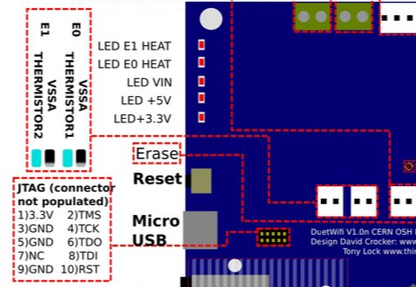
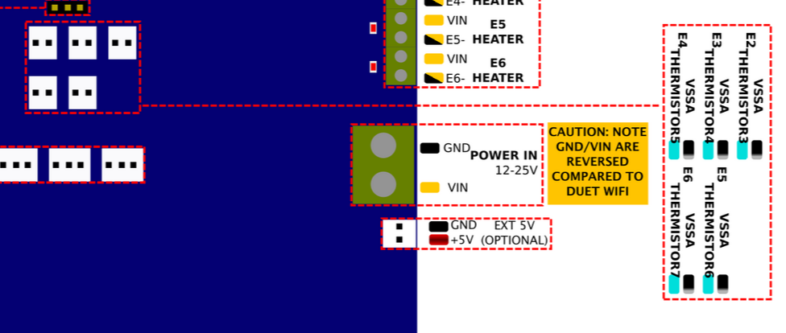
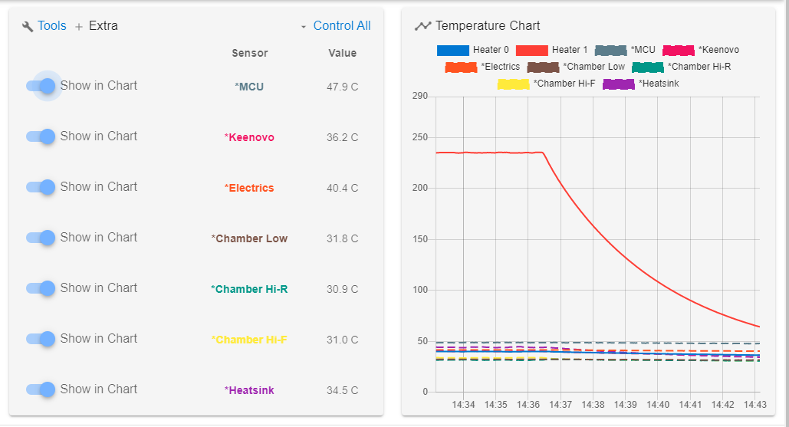

# Adding More Thermistors

## Default pair
The Duet has three Thermistor inputs, of which two are used for the standard RailCore build.
1. The Bed Thermistor is assigned to P0.  This is the bead you glued into the top of the bed surface and connected to `THERMISTOR0 BED` on the Duet.
1. The Hot-End Thermistor is assigned to P1 and used to regulate the hot-end extrusion temperature using `THERMISTOR1 E0`

The `M305` GCODE defines these in `config.g` as appropriate for your build, for example:
```
; Bed Thermistor (white-wire bead in the bed channel) is NTC 3950 100K [X0=Bed]
M305 P0 T100000 B3950 R4700 C0 H0 L0

; E3D V6 Thermistor cartridge is Semitec 104GT-2 [X1=E0]
M305 P1 T100000 B4725 R4700 C7.06e-8 H0 L0
```

## Available ports
In addition to the two above, the Duet2 has a third unused Thermistor input and the Duex5 has five more thermistor inputs for added expansion.

### Keenovo thermistor
The Kit's Keenovo bed heater has an additional NTC 100K thermistor bundled into the heater, so why not connect it for monitoring?  Plug it into the `E1 THERMISTOR2` port on the Duet, which is selected by the `X2` flag for `M305`:



```
; Keenovo NTC 100K (Beta 25/50 3950K 1%) Thermistor in bed heater (red wires) [X2=E1 Extruder]
M305 P103 X2 T100000 B3950 R4700 C0 H0 L0 S"Keenovo"
```
### Virtual Heaters
Thermistors that are not associated with Tools or Heaters can be assigned to a "Virtual Heater" in RRF2.  This gives a means for them to show up in the DWC Web interface and on the graph.  The first three Virtual Heaters are pre-defined in Duet RRF2 and cannot be used for thermistors:
* `P100` is the internal MCU (CPU) temperature
* `P101` and `P102` are over-temperature signals from the TMC2660 drivers

`P103` and higher can be used for our added thermistors.

### Duex thermistor inputs
The Duex5 adds another *five* thermistor inputs!  Go nuts.. they're really cheap.  [Five thermistors for $8 on Amazon](https://www.amazon.com/gp/product/B07Z644ZH2) in June 2020.  These come terminated with 2-pin connectors that will work fine, and they are non-polarized, safe to plug in either way.



The five Duex inputs are numbered on the board's silkscreen and diagram.  Note that the RRF2 `M305` gcode uses the `THERMISTOR` number and `X` designation for each, instead of the `E` number:
* `E2 THERMISTOR3` = `X3` 
* `E3 THERMISTOR4` = `X4` 
* `E4 THERMISTOR5` = `X5` 
* `E5 THERMISTOR6` = `X6` 
* `E6 THERMISTOR7` = `X7` 

To view the thermistor readings, each one should be added to a new Virtual Heater and assigned a name:
```
M305 P104 X3 T100000 B3950 R4700 C0 H0 L0 S"Electrics"
M305 P105 X4 T100000 B3950 R4700 C0 H0 L0 S"Chamber Low"
M305 P106 X5 T100000 B3950 R4700 C0 H0 L0 S"Chamber Hi-R"
M305 P107 X6 T100000 B3950 R4700 C0 H0 L0 S"Chamber Hi-F"
M305 P108 X7 T100000 B3950 R4700 C0 H0 L0 S"Heatsink"
```
The new values show up under Extra:


## Fan Control
Additional fans can be controlled thermostatically from these new virtual heaters by associating them.
For example, Fan P3 can cool an enclosure based on the Virtual Heater 106 thermistor above, coming on at 60° and maximum speed at 62°C:

```
M106 P3 H106 T60:62 L0.01 S1.00 B0.1 I0 C"Top R"
```

Thermistors are cheap, easy to place around the RailCore, and easy to configure for added visibility into the machine's operation.
