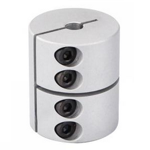
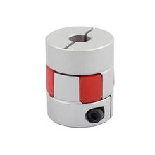
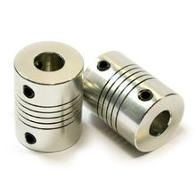
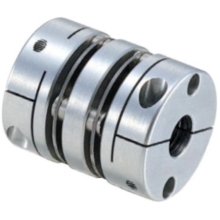
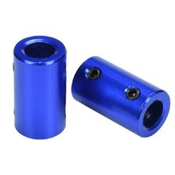

There are several options for leadscrew couplers, listed in order of preference.  This is opinion, feel free to test and evaluate yourself.

#### 1. Rigid coupler

These couplers are made of two separate pieces of aluminum and a center plastic joint. They center the leadscrew & stepper better than the solid couplers, and are very quiet. When carefully aligned they can produce less Z artifacts than either the rigid or spring couplers, however rigid are not included in kits and are not recommended unless you are exacting in your alignment.

#### 2. Joint/spider/plum Coupler

These couplers are made of two separate pieces of aluminum and a center plastic joint. They center the leadscrew & stepper better than the solid couplers, and are very quiet. Less Z artifacts than either the rigid or spring couplers.

#### 3. Spring Coupler

These Couplers are a common basic coupler. In testing they were louder than the others, and added Z-artifacts / banding.

#### 4. Disc Coupler

Can produce good prints similar to the pigid couplers, but not enough to be worth the cost

#### 5. Solid Coupler

These Couplers are a rigid style. Issues are mostly around centering the leadscrew and stepper shaft.  Quieter than a spring style coupler, but can add offset, wobble and some Z artifacts. Not recommended.
