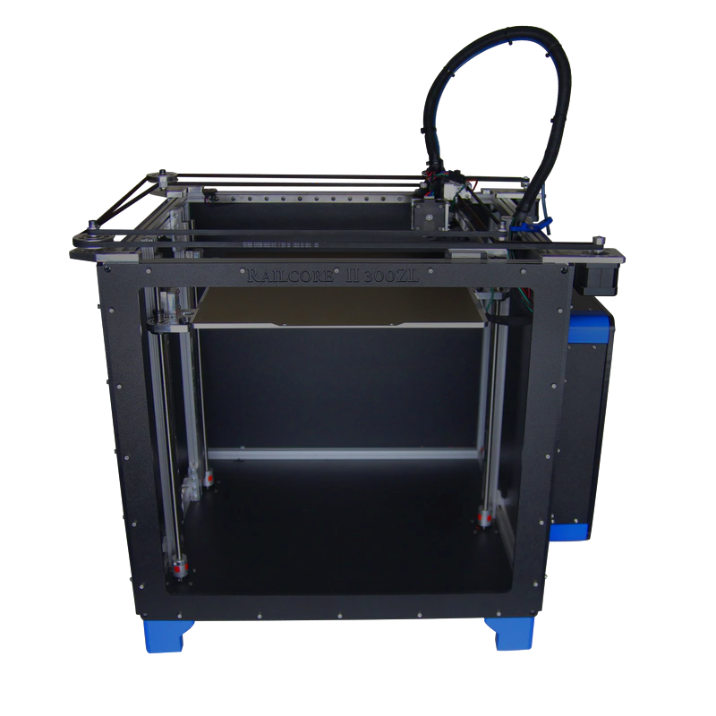
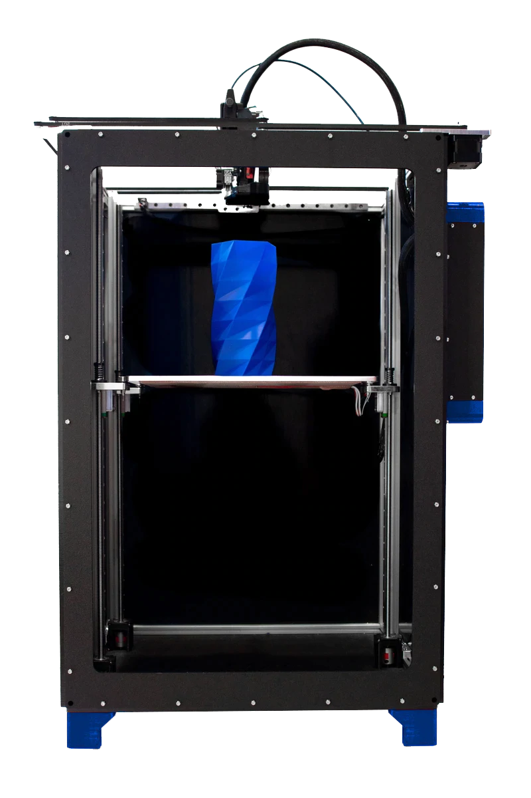

RailCore® is a family of [Core-XY based Reprap 3D printers](https://reprap.org/wiki/CoreXY) designed by J. Steve White, Tony Akens, and Ben Withem under the [CC-Attribution Only license](https://creativecommons.org/licenses/by/4.0/).

|RailCore II 300ZL|RailCore II 300ZLT|RailCore Mini|
|-|-|-|
||||

## Table of RailCore Versions

|| RailCore II ZL|RailCore II 300ZL|RailCore II 300ZLT|RailCore Mini|
|-|-|-|-|-|
|X/Y Printable|250xmm250mm|300mmx300mm|300mmx300mm|150mmx150mm|
|Z Printable|280mm|330mm|600mm|150mm|
|ABL|Yes|Yes|Yes|Yes|
|Source Files|[Model](http://a360.co/2DoeHFu)|[Model](http://a360.co/2D5OryV)|[Model](https://a360.co/2w7PjT6)|[Github](https://github.com/railcore/railcore-mini)|
|Bill of Materials|[BOM](https://docs.google.com/spreadsheets/d/1QZgV6a6Gk4xR9WxrK2C4QYaPQTXA8t7dFDyHO74-oSY/edit?usp=sharing)|[BOM](https://docs.google.com/spreadsheets/d/1sxKl6h23SXfuNM7hNiX35rIrpISw8AruEEcNl2Fvibk/edit?usp=sharing)| [BOM](https://docs.google.com/spreadsheets/d/1sxKl6h23SXfuNM7hNiX35rIrpISw8AruEEcNl2Fvibk/edit?usp=sharing)|[BOM](https://docs.google.com/spreadsheets/d/1TM1vca-hA29apzcBjQ2FyvvZ5D19cWTZl7NxzBflSlU/edit#gid=0)|
|Assembly Guide|[Guide](https://docs.google.com/document/d/1OoXfw7aXMz0NzAxkdwuChC0FpunLRyKI02_1vJF52hk/edit?usp=sharing)|[Guide](https://railcore.dozuki.com/c/RailCore_II)|[Guide](https://railcore.page.link/fskit)|[Guide](https://railcore.dozuki.com/c/RailCore%C2%AE_Mini_Kit)|
|Outer dimensions (excl.260mm for loom)|522mm x 445mm x 496mm|572mm x 495mm x 546mm|572mm x 495mm x 830mm| 400mm x 312mm x 470mm|

## RailCore II Community Resources

* [Hardware](/hardware) - all about choosing and sourcing the parts for your RailCore II.
* [Build & Troubleshoot](/build_and_troubleshoot) - how to assemble and get your RailCore II running.
* [Software](/software) - how to configure the firmware on your RailCore II as well as your slicer.
* [Customization](/customization) - information of variations and customization of the RailCore II.

## Community

Read all about the [design history](design_history.md) of the RailCore II and how it came to be.
More questions? Have a look at the [General FAQ](/faq.md)

## General specifications

|All models        | Typical specifications, these may vary by kit and self-source.                      |
|------------------|------------------------------------------------------------------------------------|
|Motion system     | CoreXY with linear rails and lead screws, capable of moving 200-400mm/s            |
|Bed specifications| 6.35mm MIC6 cast aluminium tool plate with Keenovo silicone bed heater             |
|Electronics       | Duet2 + Duex or Duet3 recommended                                                  |
|Probe             | BL-Touch, IR probe, or Piezo are common.                                           |
|Z step            | Typically 0.01mm, but dependent on leadscrews and Z steppers. 0.0025mm is possible |
|Steppers          | 0.9 degree on XYZ                                                                  |
|Parts materials   | Printed and machined aluminium parts are available                                 |
|Materials         | PLA, ABS, PETG, TPU, TPE, PP, HIPS, Ninjaflex, Laywood, Laybrick, Nylon, Bamboofill, Bronzefill, ASA, T-Glase, Carbon-fiber filaments, Polycarbonate, and more. |

## Support

*A special thanks to [Filastruder](https://www.filastruder.com/), [Duet3d](https://www.duet3d.com/), [E3D](https://e3d-online.com/), [Mandala Rose Works](http://www.mandalaroseworks.com), and [713 Maker](https://713maker.com), and of course our amazing community of builders, for your continued support of the project.  Thanks as well to former supporters including [SeeMeCNC](https://www.seemecnc.com/), [ProjectR3d](https://projectr3d.com), and [Printed Solid](https://printedsolid.com) for helping us along the way.*

RAILCORE is a registered trademark of RailCore Labs, LLC

*You can support this project by assisting with documentation via our [Contributing page](/contributing/).*
