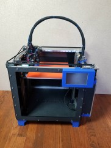
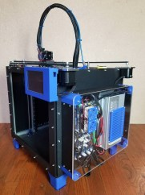

RailCore II is a [Core-XY based Reprap 3D printer](https://reprap.org/wiki/CoreXY) designed by J. Steve White & Tony Akens under the [CC-Attribution Only license](https://creativecommons.org/licenses/by/3.0/).

| Front                                                                                                 | Side                                                                                                | Parts                                                                               | Prints                                                                   |
|-------------------------------------------------------------------------------------------------------|-----------------------------------------------------------------------------------------------------|-------------------------------------------------------------------------------------|--------------------------------------------------------------------------|
|  |  |  |  |

 [*Be a patron or donate to the project*](https://www.kraegar.com/railcoreii) - *Donations and subscriptions go towards the development of new improvements for the RailCore II.*

## RailCore II Community Resources

Please read these resources carefully to answer many common questions, and contribute information where you can add!

See our [Contributing page](/contributing/) for more information on contributing to these guides.

* [Hardware](/hardware) - all about choosing and sourcing the parts for your RailCore II.
* [Build & Troubleshoot](/build_and_troubleshoot) - how to assemble and get your RailCore II running.
* [Software](/software) - how to configure the firmware on your RailCore II as well as your slicer.
* [Customization](/customization) - information of variations and customization of the RailCore II.

### Discussion
   * [Facebook Group](https://www.facebook.com/groups/RailCore/)
   * [Reddit sub](https://www.reddit.com/r/railcore/) *new*

### Chat

   * [Discord Channel](https://discord.gg/Sy569Hq)
   * [#RailCore IRC channel on freenode](https://tinyurl.com/yxl725zs) - *you must be authenticated with Freenode to enter the channel*

Read all about the [design history](design_history.md) of the RailCore II and how it came to be.
More questions? Have a look at the [General FAQ](/faq.md)

## Table of RailCore II ZL Versions

|                   | RailCore II ZL                                                                                              | RailCore II 300ZL                                                                                                                                                                                                        | RailCore II 300ZLT                                                                                                                                                                                                       |
|-------------------|-------------------------------------------------------------------------------------------------------------|--------------------------------------------------------------------------------------------------------------------------------------------------------------------------------------------------------------------------|--------------------------------------------------------------------------------------------------------------------------------------------------------------------------------------------------------------------------|
| X/Y Printable     | 250×250                                                                                                     | 300×300                                                                                                                                                                                                                  | 300×300                                                                                                                                                                                                                  |
| Z Printable       | 280                                                                                                         | 330                                                                                                                                                                                                                      | 600                                                                                                                                                                                                                      |
| Auto Leveling?    | Yes                                                                                                         | Yes                                                                                                                                                                                                                      | Yes                                                                                                                                                                                                                      |
| Fusion 360 Model  | [Model](http://a360.co/2DoeHFu)                                                                             | [Model](http://a360.co/2D5OryV)                                                                                                                                                                                          | [Model](https://a360.co/2w7PjT6)                                                                                                                                                                                         |
| Bill of Materials | [BOM](https://docs.google.com/spreadsheets/d/1QZgV6a6Gk4xR9WxrK2C4QYaPQTXA8t7dFDyHO74-oSY/edit?usp=sharing) | [BOM](https://docs.google.com/spreadsheets/d/1Eib0IkmRiP-zVM2p6gZ9PJ2bsDDvSKWbGtUybuFWfcs/edit?usp=sharing)                                                                                                              | [BOM](https://docs.google.com/spreadsheets/d/1L8mOABLsbfHb1PVPEnT-TpgfRpO25UduGNxD8GNMPSs/edit?usp=sharing)                                                                                                              |
| Assembly Guide    | [Guide](https://docs.google.com/document/d/1OoXfw7aXMz0NzAxkdwuChC0FpunLRyKI02_1vJF52hk/edit?usp=sharing)   | [Guide](https://docs.google.com/document/d/19FuTYfwqgOkGO8SUScnSuhS_Gx8mJMmXLiPgBfGeJ-s/edit?usp=sharing) [Kit wiring](https://docs.google.com/document/d/1aIc6x7Vzb-bH8-pILNBV1cXyp3JWsIa50Y6eSjMmCgM/edit?usp=sharing) | [Guide](https://docs.google.com/document/d/19FuTYfwqgOkGO8SUScnSuhS_Gx8mJMmXLiPgBfGeJ-s/edit?usp=sharing) [Kit wiring](https://docs.google.com/document/d/1aIc6x7Vzb-bH8-pILNBV1cXyp3JWsIa50Y6eSjMmCgM/edit?usp=sharing) |

*A special thanks to [Filastruder](https://www.filastruder.com/), [Duet3d](https://www.duet3d.com/), [E3D](https://e3d-online.com/), [SeeMeCNC](https://www.seemecnc.com/), [Mandala Rose Works](http://www.mandalaroseworks.com/product/railcore), [713 Maker](https://713maker.com/railcore) and [Project R3D](https://www.projectr3d.com/) for supporting the project.*
