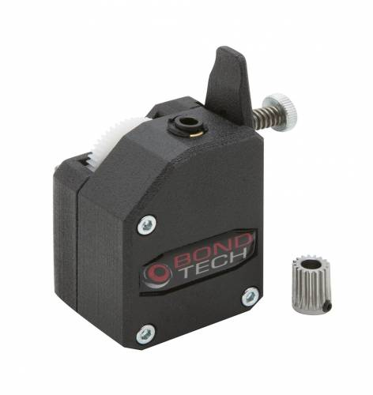

The RailCore will work with nearly any common 3d printer Extruder design.

The "default" extruder is the E3D titan - readily available,
it's lightweight enough to mount as a direct drive, and has decent 3:1 gearing.

The popular upgrade option is the Bondtech BMG, which also has 3:1 gearing, but is more solid and uses two drive gears to push the filament to the hotend.

